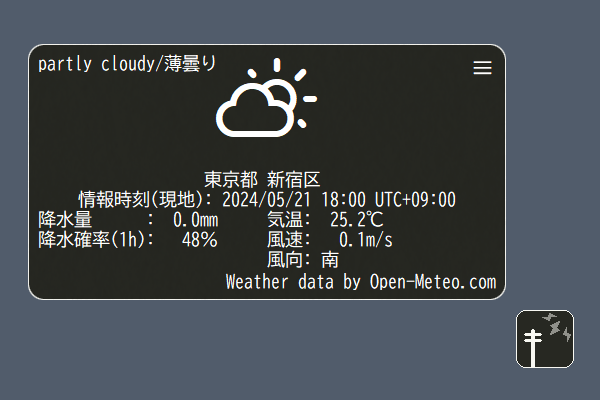

# WeatherTimeCapsule

## 概要
ゴースト「WeatherTimeCapsule」
設定した座標と時刻の天気を表示します。 
データがある範囲でなら、過去の記録や予報の天気も取得できます。

メーターをつつくと表示・非表示が切り替わります。 
天気表示の右上の３本線から設定に移動します。

オフライン環境では何もできません。 
小さいバルーンでは表示が乱れます。

作者: [ろすえん(lost_nd_xxx)](https://lnx.flop.jp/)

## 動作環境
[SSP](https://ssp.shillest.net/)(またはSSPと互換性のあるベースウェア)で動作します。

## ダウンロード
[最新のファイルはこちらからDLできます。](https://github.com/lost-nd-xxx/WeatherTimeCapsule/releases/latest/download/WeatherTimeCapsule.nar)

## 更新履歴
* [大まかな更新履歴](https://lost-nd-xxx.hateblo.jp/archive/category/%E6%9B%B4%E6%96%B0%E6%83%85%E5%A0%B1%EF%BC%9A%E4%BC%BA%E3%81%8B%E3%82%B4%E3%83%BC%E3%82%B9%E3%83%88-WeatherTimeCapsule)
* [詳細な更新履歴](https://github.com/lost-nd-xxx/WeatherTimeCapsule/commits/main/)

## 使用素材一覧・このゴーストへの二次創作時のライセンス
* [readme.txt](https://github.com/lost-nd-xxx/WeatherTimeCapsule/blob/main/readme.txt)をお読みください。
